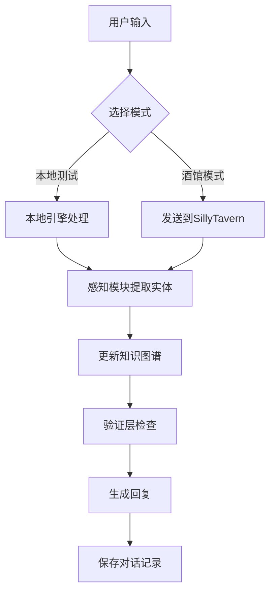

# ChronoForge - 智能角色扮演助手


## 项目简介

ChronoForge 是一个基于大语言模型的智能角色扮演助手，集成了动态知识图谱、感知系统和验证层，为用户提供沉浸式的角色扮演体验。系统支持本地测试模式和SillyTavern酒馆模式，具备完整的知识管理和对话记忆功能。

## 主要特性

### 🎭 智能对话系统
- **本地测试模式**：独立运行，快速测试对话功能
- **酒馆集成模式**：与SillyTavern无缝对接，享受完整的角色扮演体验
- **对话记忆管理**：支持多对话切换、重命名、删除等完整的会话管理
- **实时状态显示**：清晰的连接状态指示和模式切换

### 🕸️ 动态知识图谱
- **可视化图谱**：基于D3.js的交互式知识关系图谱
- **多类型实体**：支持角色、地点、物品、事件、概念等多种实体类型
- **关系编辑**：可视化创建、编辑和删除实体间的关系
- **动态属性**：每个实体支持自定义的动态属性系统
- **图谱导出**：支持知识图谱的JSON格式导出

### 🧠 GRAG记忆系统
- **图检索增强生成**：基于知识图谱的检索增强生成系统
- **感知模块**：智能识别和提取对话中的实体和关系
- **验证层**：确保生成内容的一致性和逻辑性
- **持久化存储**：自动保存对话历史和知识图谱数据

### 🛠️ 开发者友好
- **WebChannel通信**：JavaScript与Python之间的实时双向通信
- **开发者工具**：集成的网页开发者工具，便于调试图谱交互
- **模块化架构**：清晰的代码结构，易于扩展和维护
- **配置管理**：灵活的环境配置和API设置

## 系统架构

```
ChronoForge/
├── src/
│   ├── core/           # 核心模块
│   │   ├── game_engine.py      # 游戏引擎
│   │   ├── rpg_text_processor.py # RPG文本处理器
│   │   ├── perception.py       # 感知模块
│   │   └── validation.py       # 验证层
│   ├── memory/         # 记忆系统
│   │   └── grag_memory.py     # GRAG记忆模块
│   └── agents/         # 智能体模块
├── run_ui.py          # 主程序UI
├── api_server.py      # API服务器
├── config.yaml        # 主配置文件
└── requirements.txt   # 依赖列表
```

## 工作流程

### 1. 系统启动
1. **环境初始化**：加载配置文件，初始化日志系统
2. **核心组件启动**：依次初始化记忆系统、感知模块、验证层和游戏引擎
3. **API服务器启动**：在指定端口启动FastAPI服务器
4. **UI界面启动**：显示主界面，包含智能对话、知识图谱和系统配置三个标签页

### 2. 对话处理流程


### 3. 知识图谱管理
1. **实体识别**：感知模块自动从对话中提取实体信息
2. **关系建立**：通过可视化界面手动或自动建立实体间关系
3. **图谱更新**：实时更新知识图谱的显示和存储
4. **数据持久化**：定期保存图谱数据到本地JSON文件

### 4. 内存管理
- **短期记忆**：当前对话的上下文信息
- **长期记忆**：持久化的知识图谱和历史对话
- **检索机制**：基于相似性和关联性的智能检索
- **更新策略**：增量更新和冲突解决机制

## 快速开始

### 环境要求
- Python 3.8+
- PySide6 (Qt6)
- FastAPI + Uvicorn
- 其他依赖见 `requirements.txt`

### 安装步骤

1. **克隆项目**
```bash
git clone https://github.com/duiywegkl/chronoforge.git
cd chronoforge
```

2. **安装依赖**
```bash
pip install -r requirements.txt
```

3. **配置环境**
```bash
# 复制环境配置模板
cp .env.example .env
# 编辑配置文件，设置API密钥等信息
```

4. **启动程序**
```bash
python run_ui.py
```

### 配置说明

在 `.env` 文件中配置以下参数：
- `OPENAI_API_BASE_URL`: LLM API服务地址
- `OPENAI_API_KEY`: API密钥
- `DEFAULT_MODEL`: 默认使用的模型名称
- `API_SERVER_PORT`: API服务器端口（默认9543）
- `LLM_STREAM_OUTPUT`: 是否启用流式输出

## 使用指南

### 智能对话
1. 在"智能对话"标签页选择运行模式（本地测试/酒馆模式）
2. 创建新对话或选择现有对话
3. 输入消息开始对话，支持Ctrl+Enter快速发送
4. 系统会自动提取实体信息并更新知识图谱

### 知识图谱操作
1. 在"知识图谱"标签页查看当前的实体关系网络
2. 使用搜索框快速定位特定实体
3. 通过类型过滤器筛选不同类型的实体
4. 点击"编辑关系"进入关系编辑模式
5. 拖拽节点调整图谱布局，点击节点或关系进行编辑

### 系统配置
1. 在"系统配置"标签页修改LLM API设置
2. 调整服务器端口和输出模式
3. 保存配置后重启程序生效

## API接口

ChronoForge 提供RESTful API接口，支持：
- `/chat/completions` - 聊天完成接口（兼容OpenAI格式）
- `/health` - 健康检查接口
- `/api/memory/*` - 记忆系统接口
- `/api/entities/*` - 实体管理接口

详细API文档请参考 `docs/api.md`

## 开发指南

### 项目结构说明
- `src/core/`: 核心业务逻辑模块
- `src/memory/`: 记忆和知识图谱管理
- `src/agents/`: 智能体相关功能
- `examples/`: 使用示例和测试脚本
- `docs/`: 项目文档

### 扩展开发
1. **添加新的实体类型**：在`src/memory/grag_memory.py`中扩展实体类型定义
2. **自定义感知模块**：继承`PerceptionModule`类实现特定的实体识别逻辑
3. **集成新的LLM**：在`src/core/game_engine.py`中添加新的模型适配器

## 故障排除

### 常见问题
1. **WebView显示空白**：检查网络连接，确保可以访问D3.js CDN
2. **API连接失败**：验证`.env`文件中的API配置是否正确
3. **图谱加载缓慢**：考虑下载D3.js到本地`assets/js/`目录
4. **内存使用过高**：定期清理历史对话记录和临时文件

### 调试工具
- 使用F12或右键菜单打开网页开发者工具
- 查看`logs/`目录中的详细日志信息
- 使用`examples/memory_system_demo.py`测试核心功能

## 贡献指南

欢迎提交Issue和Pull Request！

1. Fork本项目
2. 创建特性分支：`git checkout -b feature/amazing-feature`
3. 提交更改：`git commit -m 'Add amazing feature'`
4. 推送分支：`git push origin feature/amazing-feature`
5. 提交Pull Request

## 致谢

特别感谢以下优秀的AI助手在项目开发过程中提供的宝贵支持：

### 🌟 月费优秀员工
- **Claude-4-Sonnet**: 在系统架构设计、代码重构和复杂逻辑实现方面提供了专业的技术指导
- 其中大部分逻辑都由Claude重构并能且实现，估计以后也要通过它进行开发和维护

### 🌟 免费优秀员工  
- **Gemini-2.5-Pro**: 在项目初期规划、代码审查和文档编写方面给予了重要帮助